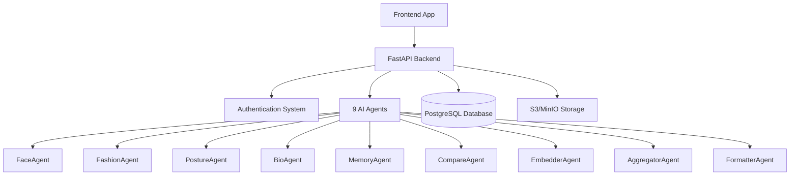

# LifeMirror Frontend Integration Guide

## 🎯 **Overview**

Welcome to the LifeMirror backend integration guide! This document provides everything you need to build a frontend for the LifeMirror platform. The backend is **fully functional** with all core features implemented and ready for integration.

### **What LifeMirror Does**
LifeMirror is an AI-powered platform that analyzes photos/videos to provide insights on:
- **Facial Analysis** - Face detection, attributes, expressions
- **Fashion Analysis** - Clothing detection, style critique, improvement suggestions  
- **Posture Analysis** - Body alignment, posture scoring, tips
- **Bio/Text Analysis** - Profile text analysis, vibe assessment
- **Comparison Analysis** - Compare with celebrities, past self, or peers
- **Memory Search** - Semantic search through past analyses

## 🏗 **Architecture Overview**



## 🔐 **Authentication System**

### **Authentication Flow**
1. **Registration/Login** → Get access & refresh tokens
2. **API Requests** → Include `Authorization: Bearer <access_token>`
3. **Token Refresh** → Use refresh token when access token expires

### **Auth Endpoints**

#### **POST /auth/register**
```typescript
interface RegisterRequest {
  email: string;
  password: string;
  public_alias?: string;
  opt_in_public_analysis?: boolean;
}

interface AuthResponse {
  access_token: string;
  refresh_token: string;
  token_type: "bearer";
}
```

#### **POST /auth/login**
```typescript
interface LoginRequest {
  email: string;
  password: string;
}
// Returns: AuthResponse
```

#### **POST /auth/refresh**
```typescript
interface RefreshRequest {
  refresh_token: string;
}
// Returns: AuthResponse
```

#### **GET /auth/me**
```typescript
interface UserProfile {
  id: string;
  email: string;
  public_alias?: string;
  opt_in_public_analysis: boolean;
  is_active: boolean;
  created_at: string;
  last_login?: string;
}
```

### **Frontend Auth Implementation Example**

```typescript
class AuthService {
  private accessToken: string | null = null;
  private refreshToken: string | null = null;

  async login(email: string, password: string): Promise<AuthResponse> {
    const response = await fetch('/auth/login', {
      method: 'POST',
      headers: { 'Content-Type': 'application/json' },
      body: JSON.stringify({ email, password })
    });
    
    if (!response.ok) throw new Error('Login failed');
    
    const data: AuthResponse = await response.json();
    this.setTokens(data.access_token, data.refresh_token);
    return data;
  }

  async makeAuthenticatedRequest(url: string, options: RequestInit = {}): Promise<Response> {
    const headers = {
      ...options.headers,
      'Authorization': `Bearer ${this.accessToken}`,
      'Content-Type': 'application/json'
    };

    let response = await fetch(url, { ...options, headers });
    
    // Auto-refresh token if expired
    if (response.status === 401) {
      await this.refreshAccessToken();
      headers['Authorization'] = `Bearer ${this.accessToken}`;
      response = await fetch(url, { ...options, headers });
    }
    
    return response;
  }

  private async refreshAccessToken(): Promise<void> {
    const response = await fetch('/auth/refresh', {
      method: 'POST',
      headers: { 'Content-Type': 'application/json' },
      body: JSON.stringify({ refresh_token: this.refreshToken })
    });
    
    if (!response.ok) throw new Error('Token refresh failed');
    
    const data: AuthResponse = await response.json();
    this.setTokens(data.access_token, data.refresh_token);
  }
}
```

## 📸 **Media Upload & Analysis**

### **Upload Flow**
1. **Get presigned URL** → Request upload permission
2. **Upload to storage** → Direct upload to S3/MinIO
3. **Create media record** → Register media in database
4. **Request analysis** → Trigger AI analysis pipeline

### **Media Upload Endpoints**

#### **POST /media/presign**
```typescript
interface PresignRequest {
  filename: string;
  content_type: string; // "image/jpeg", "image/png", "video/mp4", etc.
  user_id: string;
}

interface PresignResponse {
  upload_url: string;
  key: string;
}
```

#### **POST /media/**
```typescript
interface MediaCreateRequest {
  storage_url: string;
  mime: string;
  user_id: string;
  metadata?: Record<string, any>;
}

interface MediaCreateResponse {
  media_id: string;
}
```

### **Media Upload Implementation Example**

```typescript
class MediaService {
  async uploadMedia(file: File, userId: string): Promise<string> {
    // Step 1: Get presigned URL
    const presignResponse = await authService.makeAuthenticatedRequest('/media/presign', {
      method: 'POST',
      body: JSON.stringify({
        filename: file.name,
        content_type: file.type,
        user_id: userId
      })
    });
    
    const { upload_url, key } = await presignResponse.json();
    
    // Step 2: Upload to storage
    await fetch(upload_url, {
      method: 'PUT',
      body: file,
      headers: { 'Content-Type': file.type }
    });
    
    // Step 3: Create media record
    const mediaResponse = await authService.makeAuthenticatedRequest('/media/', {
      method: 'POST',
      body: JSON.stringify({
        storage_url: upload_url.split('?')[0], // Remove query params
        mime: file.type,
        user_id: userId,
        metadata: { original_name: file.name, size: file.size }
      })
    });
    
    const { media_id } = await mediaResponse.json();
    return media_id;
  }
}
```

## 🧠 **AI Analysis System**

### **Core Analysis Endpoint**

#### **POST /analysis/analyze**
This is the **main analysis endpoint** that runs all AI agents and returns comprehensive results.

```typescript
interface AnalysisRequest {
  media_id: string;
  user_consent?: {
    face_analysis?: boolean;
    fashion_analysis?: boolean;
    posture_analysis?: boolean;
    bio_analysis?: boolean;
    detailed_analysis?: boolean;
    biometric_analysis?: boolean;
    technical_metadata?: boolean;
  };
  bio_text?: string; // Optional profile text to analyze
  options?: Record<string, any>;
}

interface FinalAnalysisResponse {
  media_id: string;
  timestamp: string;
  
  // Summary scores (0-10)
  overall_score: number;
  attractiveness_score?: number;
  style_score?: number;
  presence_score?: number;
  
  // Human-readable results
  summary: string;
  key_insights: string[];
  recommendations: string[];
  
  // Detailed analysis (if consented)
  detailed_analysis?: {
    face?: FaceAnalysisData;
    fashion?: FashionAnalysisData;
    posture?: PostureAnalysisData;
    bio?: BioAnalysisData;
  };
  
  // Metadata
  confidence: number;
  processing_metadata: Record<string, any>;
  langsmith_run_id?: string;
  
  // Safety
  warnings: string[];
  disclaimers: string[];
}
```

### **Analysis Implementation Example**

```typescript
class AnalysisService {
  async analyzeMedia(
    mediaId: string, 
    bioText?: string,
    consent?: UserConsent
  ): Promise<FinalAnalysisResponse> {
    const response = await authService.makeAuthenticatedRequest('/analysis/analyze', {
      method: 'POST',
      body: JSON.stringify({
        media_id: mediaId,
        bio_text: bioText,
        user_consent: consent || {
          face_analysis: true,
          fashion_analysis: true,
          posture_analysis: true,
          bio_analysis: !!bioText,
          detailed_analysis: true
        }
      })
    });
    
    if (!response.ok) {
      throw new Error(`Analysis failed: ${response.statusText}`);
    }
    
    return await response.json();
  }
}
```

## 🚀 **Enhanced Analysis Options (NEW)**

The backend now offers **three analysis approaches** to suit different needs:

### **1. Core Analysis (Original)**
- **Endpoint**: `POST /analysis/analyze`
- **Use Case**: Fast, focused analysis
- **Features**: Face, Fashion, Posture, Bio, Embedding analysis
- **Response Time**: ~2-5 seconds

### **2. Enhanced Analysis (NEW)**
- **Endpoint**: `POST /analysis/analyze/enhanced` 
- **Use Case**: Comprehensive analysis with social insights
- **Features**: Everything from Core + Specialized agents (Fixit, Vibe, History, Social)
- **Response Time**: ~5-10 seconds

#### **Enhanced Analysis Response**
```typescript
interface EnhancedAnalysisResponse {
  success: boolean;
  core_analysis: FinalAnalysisResponse;
  specialized_analysis: {
    fixit_suggestions?: {
      quick_tips: string[];
      detailed_plan: string;
      focus_areas: string[];
    };
    vibe_analysis?: {
      vibe_score: number; // 0-100
      vibe_tags: string[];
      personality_summary: string;
      strengths: string[];
      improvement_areas: string[];
    };
    perception_history?: {
      trend_summary: string;
      score_trend: Array<{timestamp: string, score: number}>;
      improvement_tags: string[];
      decline_tags: string[];
    };
    social_graph?: {
      cold_start: boolean;
      user_vibe_score: number;
      percentile: {overall: number};
      similar_users: Array<{user_id: string, alias: string, score: number}>;
      complementary_users: Array<{user_id: string, alias: string, score: number}>;
    };
    social_perception?: {
      summary_text: string;
      tags: string[];
      social_score: number; // 0-10
    };
  };
  metadata: {
    processing_mode: "enhanced_hybrid";
    user_id: string;
    analysis_timestamp: string;
  };
}
```

### **3. Hybrid Analysis (NEW)**
- **Endpoint**: `POST /analysis/analyze/hybrid`
- **Use Case**: Workflow-based analysis using LangGraph
- **Features**: Structured workflow with enhanced agents
- **Response Time**: ~5-10 seconds

#### **Hybrid Analysis Response**
```typescript
interface HybridAnalysisResponse {
  success: boolean;
  core_analysis: any;
  social_analysis: any;
  enhancements: any;
  metadata: {
    processing_mode: "enhanced_graph";
    user_id: string;
    execution_timestamp: string;
  };
  fallback_response?: any;
}
```

### **4. Comprehensive User Profile (NEW)**
- **Endpoint**: `GET /analysis/profile/comprehensive`
- **Use Case**: Complete user analysis profile
- **Features**: All analysis types combined into user profile

```typescript
interface ComprehensiveUserProfile {
  user_id: string;
  profile_components: {
    history?: any;
    current_vibe?: any;
    social_position?: any;
    improvement_suggestions?: any;
  };
  generated_at: string;
}
```

### **5. Additional Enhanced Endpoints**

#### **Reverse Goal Analysis**
```typescript
// POST /analysis/reverse-goal
interface ReverseGoalRequest {
  goal: string; // "I want to look more confident"
  recent_limit?: number;
}

interface ReverseGoalResponse {
  goal: string;
  recommended_changes: string[];
  avoid_list: string[];
  action_plan: string;
}
```

#### **Media Comparison**
```typescript
// POST /analysis/compare-media
interface MediaCompareRequest {
  media_id_1: string;
  media_id_2: string;
}

interface MediaCompareResponse {
  summary: string;
  better_media_id: number;
  comparison_tags: string[];
  score_difference: number;
}
```

#### **Generate Notifications**
```typescript
// POST /analysis/notifications/generate
interface NotificationResponse {
  status: string;
  // Notifications are stored in database
}
```

## 🔍 **Additional Analysis Features**

### **Bio/Text Analysis**

#### **POST /analysis/analyze/bio**
```typescript
interface BioAnalysisRequest {
  text: string; // 10-5000 characters
  past_analyses?: any[];
}

interface BioAnalysisResponse {
  vibe_summary: string;
  strengths: string[];
  weaknesses: string[];
  improvements: string[];
  confidence: number;
}
```

### **Memory Search**

#### **POST /analysis/search**
```typescript
interface MemorySearchRequest {
  user_id: string;
  query_text?: string;
  query_vector?: number[];
  date_range?: {
    start: string; // ISO date
    end: string;   // ISO date
  };
  limit?: number; // Max 50
  min_similarity?: number; // 0.0-1.0
}

interface MemorySearchResponse {
  query_type: string;
  total_results: number;
  results: Array<{
    media_id: string;
    similarity_score: number;
    timestamp: string;
    analysis_summary?: any;
    media_url?: string;
    thumbnail_url?: string;
  }>;
  search_metadata: Record<string, any>;
}
```

### **Comparison Analysis**

#### **POST /analysis/compare**
```typescript
interface ComparisonRequest {
  user_id: string;
  current_analysis: Record<string, any>;
  comparison_type: "celebrity" | "past_self" | "peer";
  target_id?: string; // For celebrity comparison
  time_range?: "1_month" | "3_months" | "1_year"; // For past_self
}

interface ComparisonResult {
  comparison_type: string;
  target_id?: string;
  target_name?: string;
  
  // Similarity scores (0-1)
  similarity_score: number;
  style_similarity: number;
  presence_similarity: number;
  
  // Analysis
  similarities: string[];
  differences: string[];
  insights: string[];
  recommendations: string[];
  
  confidence: number;
  comparison_metadata: Record<string, any>;
}
```

### **Celebrity List**

#### **GET /analysis/celebrities**
```typescript
interface CelebrityListResponse {
  celebrities: Array<{
    id: string;
    name: string;
    category: string;
    description: string;
  }>;
  total: number;
  categories: string[];
}
```

## 📊 **Data Models**

### **User Model**
```typescript
interface User {
  id: string;
  email: string;
  public_alias?: string;
  opt_in_public_analysis: boolean;
  password_hash: string; // Never returned in API
  is_active: boolean;
  created_at: string;
  last_login?: string;
}
```

### **Media Model**
```typescript
interface Media {
  id: string;
  user_id: string;
  media_type: "image" | "video";
  storage_url: string;
  storage_key?: string;
  thumbnail_url?: string;
  keyframes?: any; // For videos
  size_bytes: number;
  mime: string;
  metadata?: Record<string, any>;
  created_at: string;
}
```

### **Analysis Data Types**
```typescript
interface FaceAnalysisData {
  num_faces: number;
  faces: Array<{
    bbox: number[]; // [x, y, width, height]
    landmarks?: Record<string, any>;
    crop_url?: string;
    gender?: string;
    age?: number;
    age_range?: string;
    expression?: string;
  }>;
  confidence: number;
}

interface FashionAnalysisData {
  style: string;
  items: Array<{
    type: string;
    score: number;
    bbox: number[];
    crop_url: string;
    dominant_color?: string;
  }>;
  overall_rating: number;
  confidence: number;
}

interface PostureAnalysisData {
  alignment_score?: number; // 0-10
  keypoints: number[][];
  tips: string[];
  crop_url?: string;
  confidence: number;
}

interface BioAnalysisData {
  vibe_summary: string;
  strengths: string[];
  weaknesses: string[];
  improvements: string[];
  confidence: number;
}
```

## 🎨 **Recommended UX Flow**

### **1. User Registration/Login**
```
[Landing Page] → [Sign Up/Login] → [Dashboard]
```

### **2. Media Upload & Analysis**
```
[Upload Button] → [File Selection] → [Upload Progress] → [Consent Dialog] → [Analysis Progress] → [Results Display]
```

### **3. Results Display Hierarchy**
```
[Summary Card]
├── Overall Score (prominent)
├── Key Insights (3-5 bullets)
├── Recommendations (3-5 bullets)
└── [View Details Button]

[Detailed View]
├── Face Analysis Tab
├── Fashion Analysis Tab
├── Posture Analysis Tab
├── Bio Analysis Tab (if provided)
└── Comparison Tab
```

### **4. Comparison Flow**
```
[Results Page] → [Compare Button] → [Comparison Type Selection] → [Target Selection] → [Comparison Results]
```

### **5. History & Search**
```
[Dashboard] → [History Tab] → [Search Bar] → [Filter Options] → [Results Grid]
```

## 🎯 **UI Component Recommendations**

### **Core Components**

#### **AnalysisCard**
```tsx
interface AnalysisCardProps {
  analysis: FinalAnalysisResponse;
  showDetails?: boolean;
  onCompare?: () => void;
  onShare?: () => void;
}

const AnalysisCard: React.FC<AnalysisCardProps> = ({ analysis }) => (
  <div className="analysis-card">
    <div className="score-section">
      <CircularProgress value={analysis.overall_score} max={10} />
      <h3>Overall Score: {analysis.overall_score}/10</h3>
    </div>
    
    <div className="summary-section">
      <p>{analysis.summary}</p>
    </div>
    
    <div className="insights-section">
      <h4>Key Insights</h4>
      <ul>
        {analysis.key_insights.map((insight, i) => (
          <li key={i}>{insight}</li>
        ))}
      </ul>
    </div>
    
    <div className="recommendations-section">
      <h4>Recommendations</h4>
      <ul>
        {analysis.recommendations.map((rec, i) => (
          <li key={i}>{rec}</li>
        ))}
      </ul>
    </div>
  </div>
);
```

#### **MediaUpload**
```tsx
const MediaUpload: React.FC = () => {
  const [uploading, setUploading] = useState(false);
  const [progress, setProgress] = useState(0);

  const handleUpload = async (file: File) => {
    setUploading(true);
    try {
      const mediaId = await mediaService.uploadMedia(file, userId);
      // Redirect to analysis page or trigger analysis
      await startAnalysis(mediaId);
    } catch (error) {
      // Handle error
    } finally {
      setUploading(false);
    }
  };

  return (
    <div className="upload-zone">
      <input
        type="file"
        accept="image/*,video/*"
        onChange={(e) => e.files?.[0] && handleUpload(e.files[0])}
      />
      {uploading && <ProgressBar value={progress} />}
    </div>
  );
};
```

## 🚨 **Error Handling**

### **Common Error Responses**
```typescript
interface ErrorResponse {
  error: string;
  error_code?: string;
  details?: Record<string, any>;
  timestamp: string;
}

// Common error codes:
// - 401: Unauthorized (token expired/invalid)
// - 403: Forbidden (insufficient permissions)
// - 404: Not found (media/user not found)
// - 413: File too large
// - 415: Unsupported media type
// - 429: Rate limit exceeded
// - 500: Internal server error
```

### **Error Handling Example**
```typescript
class ApiError extends Error {
  constructor(
    public status: number,
    public code?: string,
    public details?: any
  ) {
    super(`API Error ${status}: ${code}`);
  }
}

async function handleApiResponse(response: Response) {
  if (!response.ok) {
    const error: ErrorResponse = await response.json();
    throw new ApiError(response.status, error.error_code, error.details);
  }
  return response.json();
}
```

## 📱 **Rate Limiting**

The API includes rate limiting to prevent abuse:

- **Analysis**: 10 requests/hour per user
- **Bio Analysis**: 20 requests/hour per user  
- **Memory Search**: 50 requests/hour per user
- **Comparisons**: 15 requests/hour per user
- **Auth**: 10 requests/minute per IP

Handle `429 Too Many Requests` responses gracefully with retry logic.

## 🔒 **Privacy & Consent**

### **User Consent Management**
```typescript
interface UserConsent {
  face_analysis: boolean;
  fashion_analysis: boolean;
  posture_analysis: boolean;
  bio_analysis: boolean;
  detailed_analysis: boolean;
  biometric_analysis: boolean; // Requires explicit opt-in
  technical_metadata: boolean;
}

// Always request consent before sensitive analysis
const ConsentDialog: React.FC = () => (
  <div className="consent-dialog">
    <h3>Analysis Permissions</h3>
    <CheckboxGroup>
      <Checkbox name="face_analysis" defaultChecked>
        Face Analysis - Detect faces and basic attributes
      </Checkbox>
      <Checkbox name="fashion_analysis" defaultChecked>
        Fashion Analysis - Analyze clothing and style
      </Checkbox>
      <Checkbox name="biometric_analysis">
        Biometric Analysis - Advanced facial measurements (optional)
      </Checkbox>
    </CheckboxGroup>
    <p className="disclaimer">
      All analysis is for entertainment purposes only and should not be 
      considered professional advice.
    </p>
  </div>
);
```

## 🎨 **Design Recommendations**

### **Visual Hierarchy**
1. **Overall Score** - Most prominent (large circular progress)
2. **Summary Text** - Clear, readable paragraph
3. **Key Insights** - Bulleted list, positive framing
4. **Recommendations** - Actionable items, encouraging tone
5. **Detailed Analysis** - Expandable sections or tabs

### **Color Psychology**
- **Green** (7-10): Excellent scores
- **Blue** (5-7): Good scores  
- **Orange** (3-5): Needs improvement
- **Red** (0-3): Significant issues (use sparingly)

### **Tone & Messaging**
- **Encouraging** - Focus on growth and improvement
- **Non-judgmental** - Avoid harsh criticism
- **Actionable** - Provide specific, doable suggestions
- **Disclaimer-aware** - Always include entertainment/non-professional disclaimers

## 🔧 **Development Setup**

### **Environment Variables**
```bash
# API Base URL
REACT_APP_API_URL=http://localhost:8000

# Optional: Enable debug mode
REACT_APP_DEBUG=true
```

### **API Client Setup**
```typescript
// api/client.ts
const API_BASE_URL = process.env.REACT_APP_API_URL || 'http://localhost:8000';

export const apiClient = {
  baseURL: API_BASE_URL,
  
  async request(endpoint: string, options: RequestInit = {}) {
    const url = `${API_BASE_URL}${endpoint}`;
    const response = await authService.makeAuthenticatedRequest(url, options);
    return handleApiResponse(response);
  }
};
```

## 📚 **Testing the Backend**

### **Health Check**
```bash
curl http://localhost:8000/health
# Expected: {"status": "ok"}
```

### **Test Authentication**
```bash
# Register
curl -X POST http://localhost:8000/auth/register \
  -H "Content-Type: application/json" \
  -d '{"email": "test@example.com", "password": "testpass123"}'

# Login
curl -X POST http://localhost:8000/auth/login \
  -H "Content-Type: application/json" \
  -d '{"email": "test@example.com", "password": "testpass123"}'
```

### **Test Analysis (Mock Mode)**
The backend runs in mock mode by default, so you can test without real AI services:

```bash
# Set mock mode
export LIFEMIRROR_MODE=mock

# Test analysis endpoint
curl -X POST http://localhost:8000/analysis/analyze \
  -H "Authorization: Bearer <your_token>" \
  -H "Content-Type: application/json" \
  -d '{"media_id": "test-media-123"}'
```

## 🚀 **Getting Started Checklist**

### **Phase 1: Basic Integration**
- [ ] Set up authentication flow
- [ ] Implement media upload
- [ ] Create basic analysis display
- [ ] Add error handling
- [ ] Test with mock data

### **Phase 2: Core Features**
- [ ] Build detailed analysis views
- [ ] Implement comparison features
- [ ] Add search functionality
- [ ] Create user dashboard
- [ ] Implement consent management

### **Phase 3: Polish & UX**
- [ ] Add loading states and animations
- [ ] Implement offline support
- [ ] Add sharing capabilities
- [ ] Create onboarding flow
- [ ] Optimize for mobile

## 📞 **Support & Resources**

### **API Documentation**
- FastAPI auto-docs: `http://localhost:8000/docs`
- OpenAPI spec: `http://localhost:8000/openapi.json`

### **Backend Status**
- ✅ All core features implemented
- ✅ Authentication working
- ✅ All AI agents functional
- ✅ Rate limiting active
- ✅ Error handling complete
- ✅ Mock mode for development

### **Questions?**
The backend is fully functional and ready for integration. All endpoints are tested and documented. If you encounter any issues or need clarification on any API behavior, the backend team can provide immediate support.

**Happy coding! 🚀**
